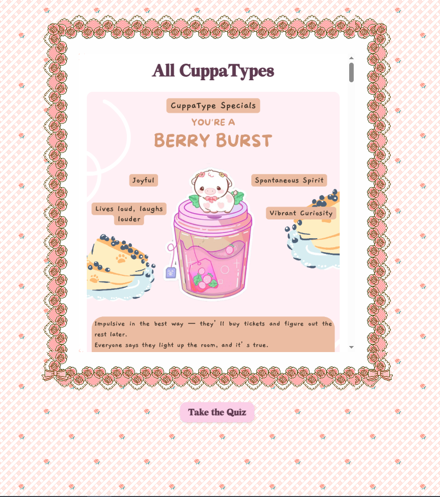

# CuppaType ❀

*CuppaType* is a cozy, pastel-themed personality quiz where your answers brew up a custom drink that reflects your vibe. It’s cute, calming, and designed to feel like a little self-care session.

**Find out what drink type you are!!>>** [CuppaType](https://manasvinaik.github.io/cuppatype/)

This is my personal project — made with love, code, and too much caffeine — and you’re absolutely welcome to use it as a base for your own creations!

---

## Features

❀ Custom-built MBTI-inspired personality quiz

❀ Adorable pastel-pink aesthetic with different drink results for your personality!

❀ Chat based interface

❀ Fully responsive design (mobile + desktop)

---

## Screenshots

### ❀ Landing Page  


### ❀ The Quiz


### ❀ Different Results customized for you! 


---


## Installation
1. Simply open the index.html file in any modern web browser.
   
2. **Clone the repo**
   ```bash
   git clone https://github.com/manasvinaik/cuppatype.git
   cd cuppatype
   ```
